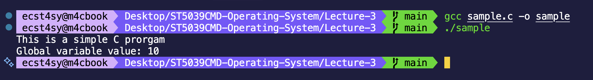
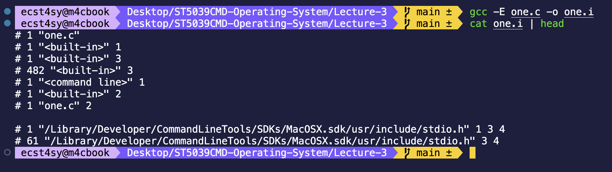
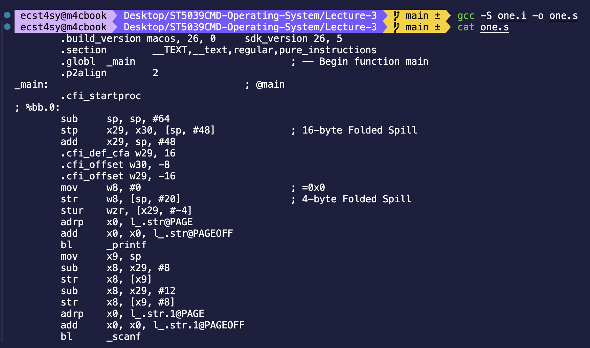
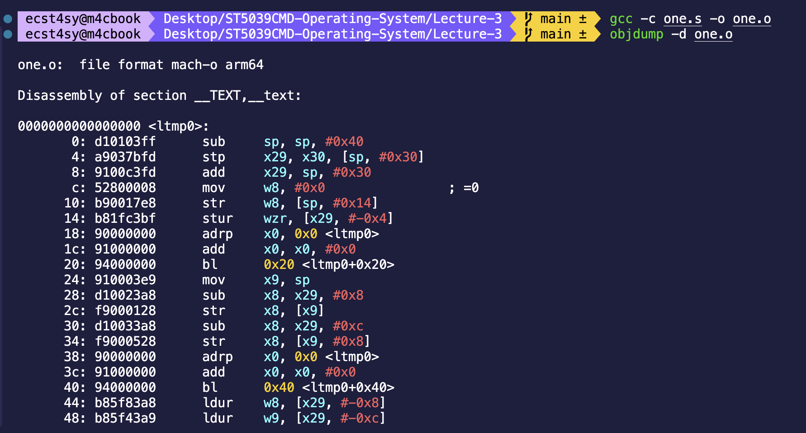

# Lecture 3 - Workings of C Program
Here we understand behind the scenes of compilation process of C programming language. Under the hood, C doesn't just get compiled into executable directly, rather it goes through the multiple stages such as preprocessing, compilation, Assembly, Linking and then only becomes executable.

## Learning Objectives
1. Understanding the basic structure of C programs
2. Understanding how C program turns into executable under the hood
3. Learning basic `gcc` commands and flags to be used during the process of debugging

## C language

>**Definition**: Basically C is a high level language meaning it can be easily understood by any human being who has an understanding of programming language to some extent.

## Notes
### Overview - Under The Hood
In order for computing machine to understand the code that is written in high level language, it must to first translated into something that computer understands (machine code aka binary). It is what compilation and creating executable does (create something that computer can understand to perform task)

Above is the gcc command used to compile source into executable `gcc sample.c -o sample` but there are lot of other abstracted things that happens before executable are created.

Here our written source code is expanded (basically all the directives / header files are expanded) and documentation (comments) are stripped from the actual source code.

We use `-E` flag for expansion and we can see that we have expanded our source code `one.c` and created output file as `one.i` which contains the actual expanded source code

> [!IMPORTANT]
> Header file that we include in our source code only contains the definition of functions, methods that we are going to use. It doesn't contain the implementation itself, and its seperate file (which are actually introduced during the linking process)

### Compilation
Next step is that preprocessed sorce code is translated into assembly language. Apparently, it is only the language that is defined in `Instruction Set Architecture (ISM)`.

Yeah, thats what assembly language actually looks like. Things that are shown in the output are **instruction sets** that are defined in ISM. This is what happens behind the seen before you get your executable. `gcc -S one.i -o one.s` is used for translated our source code into assembly language.

### Assembling
Thereafter, assembly language has to be translated into binary (machine code) in order for it to be understood / processed completely by our computers.

As we can't use `cat` into object files we use object dumper (we can use cat, but it doesn't show what needs to be shown). `objdump -d one.o` used to disassemble the object code. 

### Linking
Finally, all of the object files are combined together (***what do I mean by all?*** I mean all the included header files, pre-defined preprocessors) and final executable is created. As now all the object files are libraries used are combined, now our source code can be all the imported function. 
 
**Where's the image?**
Just look at the first image in this documentation. That's what our final executable is.
`gcc one.c -o one`

## Author
Student name - **Gaurav Poudel**
Class - **Programming & Operating System**
