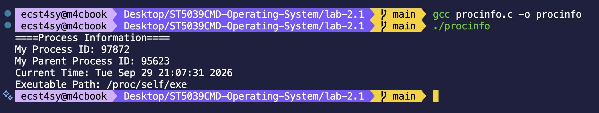
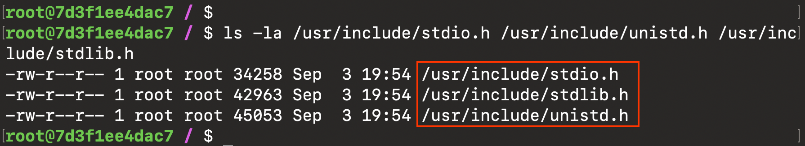
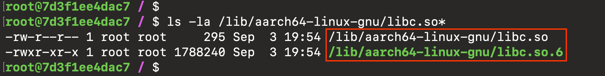
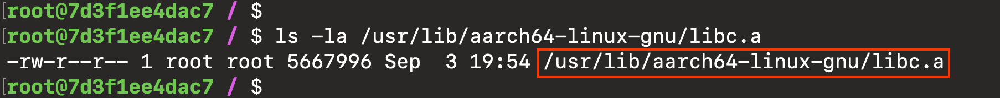
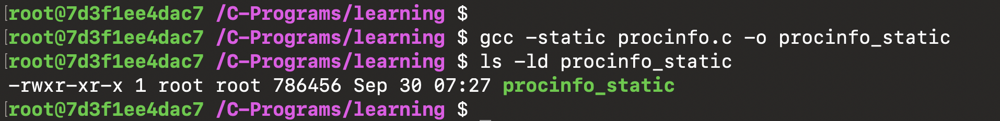
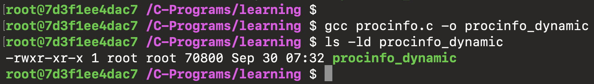

# Lab 2.1 - Anatomy of Compiled File

## Overview
In this lab, we will understand how a C program using multiple library functions link to the standard library consisting of the header files, examine physical existence of C library headers and compiled binaries, and finally the difference between static linking and dynamic linking.

## Learning Objectives
- Use multiple functions from different C standard libraries

## C Standard Library Usage
### Concept
Multiple useful functions are already implemented in C for reusability. In this task, we have demonstrated the use of multiple functions from C standard libraries (**libc**). To be precise, we have used functions to get process and time information from standard libraries such as `unistd.h` and `time.h` respectively

### Commands
```bash
# Compile the source code
gcc procinfo.c -o procinfo

# Run the program
./procinfo
```

### Evidences


We have used various functions for different purposes. `getpid()` and `getppid()` were used to extract the process ID information. `time()` and `localtime()` were used to ask OS for the current time and structure it properly.

> [!NOTE]
> Concept of pointer is applied in this program, so basically `time(NULL)` gets the current time from OS i.e. only machine readable and stores it in `current_time`, thereafter, `localtime(&current_time)` creates a proper human readable struct and stores the memory address of it in pointer `time_info`, and the pointer variable simply points to `struct tm` structure now.

## Two Parts: Headers File and Precompiled Machine Code
### Concept
In this task, we will have a look at the physical location of the C standard libraries. C standard library are most commonly called `libc`, but in linux, its called `glibc`. There are two important components of C standard library i.e header files and precompiled machine code, and both of them has distinct physical location in the computer.

>*Header Files*: Header Files (.h) contains declaration only (there is no implementation in header file). So, its purpose is to tell the compiler what functions exists, what does it expect as inputs, how to call them, and what type of data will be given as output.

>*Precompiled Machine Code*: These contains the actual implementation of functions that we use in our program such as printf(), malloc(), getpid(), etc. This library files come in two form, that are:
- **Static Libraries (.a)**: These are object files in the disk, so when you compile the program with static libraries, the **linker** pulls the exact function/part being used in our program and copies it our program.

- **Shared Libraries (.so)**: When we use dynamic libraries, we are basically *referencing*. The actual code that we are using in our program stays in disk. When you actually execute the program (**runtime**), dynamic linker finds `.so` file and loads it into the memory and connects it to our program using function from that dynamic library. 
>[!Note]
>Important part about dynamic library is that the library file being used in multiple program can be shared. For example: if 10 programs in my computer is using *printf()*, it doesn't have to copy functional implementation of *printf()* in my programs now,  all of the 10 program can share the same `libc.so` in the memory.

### Commands
```bash
# list the header files
ls -la /usr/include/stdio.h /usr/include/unistd.h /usr/include/stdlib.h

# list the static library (location is based on architecture)
ls -la /usr/lib/aarch64-linux-gnu/libc.a

# list the shared library
ls -la /lib/aarch64-linux-gnu/libc.so*
```

### Evidences


When we use these libraries such as `stdio.h`, `unistd.h`, and `stdlib.h`, etc. Compiler just copies the contents of above shown files to our program.





Above are the physical location of static and shared library.

## Static and Dynamic Linking
### Concept
**Linking** is the final step in compilation process, where external libraries used in our program are linked with our program to create it a runnable program. While static linking happens at the `compile time`, dynamic linking takes place during `run time`.

### How Each Work
- **Static Linking**: the linker (**ld**) copies the part of machine code (may be implementation for *getpid()*) to the program that is using it. **Things to note**: In this case, the program file is self-contained, but huge in size.

- **Dynamic Linking**: the *dynamic linker* loads the actual code being used by the program into memory at **runtime**. So, *what does it mean?* It means that it doesn't have to copy the machine code into our program like it does in static linking, rather it just creates a `reference` to shared libraries.

### Commands
```bash
# Compile the program using static linker
gcc -static procinfo.c -o procinfo_static

# list the program
ls -ld procinfo_static
```

### Evidences


Here the compiled file `procinfo_static` is the self-contained program file, all the function implementation and part of code from library have already been copied to this program.



What we always have been doing till now was dynamic linking, **look at the size difference!!!**, its because it doesn't copies the machine code, rather it creates a references to the machine code in the memory.