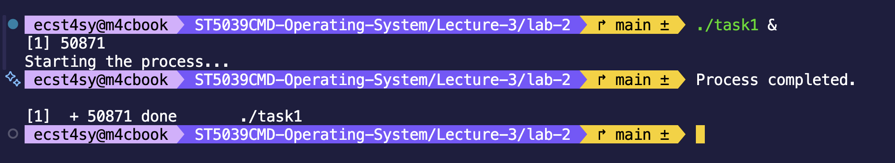
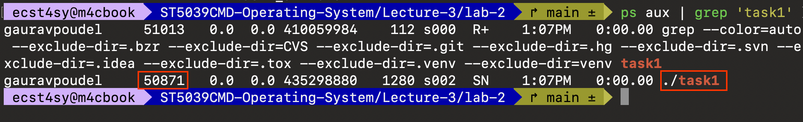
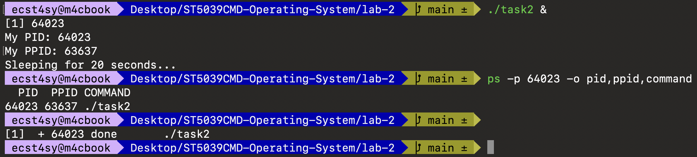

# Lab 3 - Investigating Process Lifecycles and OS Interaction
 
This lab contains the program files and understand how OS manages the process and resources in actual.

## Learning Objectives
1. Understanding how OS keeps track of PIDs and PPIDs
2. 

## Task 1: The Long Running Process

### Concept

In this lab, we'll understand the concept of PID and practically demonstrate how OS keeps track of process ID and look how it can be seen while process is actually running in the background. 

>**Definition** : PID stands for Process ID and it is a unique identifier for each process that is currently at running state.

### Commands
```bash
# Compile the source code
gcc task1_alive.c -o task1

# Run the executable in the background
./task1 &

# Monitor the process for PID
ps aux | grep 'task1'
```

### Evidences


Above it can be noticed that process is running and exited successfully, meanwhile we have verified it with `ps aux | grep 'task1'`



- **PID** : 50871 (assigned to the `task1` process)

## Task 2: Process Identity (PID & PPID)

### Concept
When we talk about linux system, each process is assigned with PID as we have already seen in the above task, but there also exist parent process ID (PPID) which is the process that created the child process (in most cases PPID is our *shell*)

>**PPID** : It is a ID for process which created a child process.

### Commands
```bash
# Compile the source code
gcc task2_identity.c -o task2

# Run the program in the background
./task2 &

# Verify it
ps -p [PID] -o pid,ppid,command
```

### Evidences


Above it is verified that both PID and PPID are identical when `getpid()` retrieves it and when we check it against the output of `ps` command

## Task 3: Exit Codes & OS Feedbacks